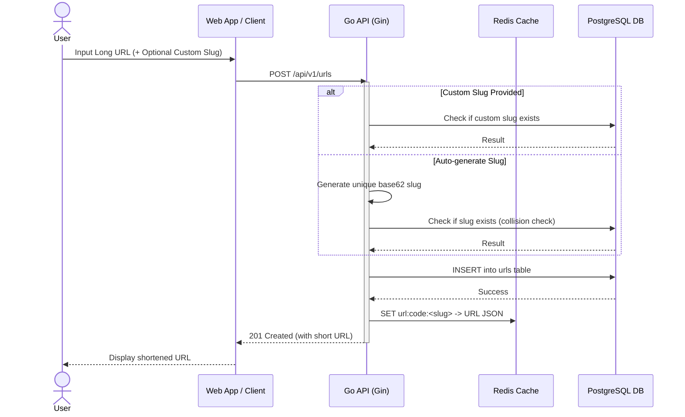
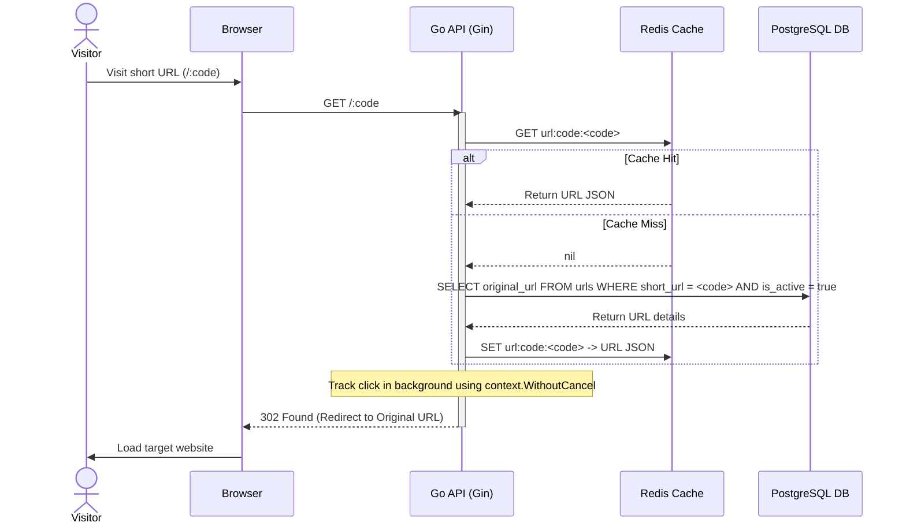

# ShortURL

A high-performance URL shortening service with analytics, role-based access control, and real-time telemetry.
Live hosted on [shorturl.soylab.dpdns.org](https://shorturl.soylab.dpdns.org/).

## System Architecture

### 1. URL Creation Flow (Long to Short)


### 2. URL Redirection Flow


### 3. Deployment & CI/CD Pipeline
```mermaid
graph TD
    Developer[Developer] -->|git push| GitHub[GitHub Repository]
    
    subgraph CI/CD (GitHub Actions)
        GitHub --> CI[CI Workflow: Lint & Test]
        CI --> CD[CD Workflow: Build Docker Image]
        CD --> GHCR[Push to GitHub Container Registry]
    end

    subgraph VPS Deployment
        GHCR -->|docker pull| VPS[Production VPS]
        Infisical[Infisical Cloud] -->|Fetch Secrets| VPS
        VPS -->|Runs| App[App Container]
        VPS -->|Runs| Redis[Redis Container]
        VPS -->|Runs| DB[Postgres Container]
        Cloudflare[Cloudflare] -->|Proxy Traffic| VPS
    end
    
    CD -->|Trigger deploy.sh| VPS
```

## Features

- **URL Shortening** — Create short URLs with custom or auto-generated slugs
- **Click Analytics** — Track device type, browser, and geographic origin
- **Role-Based Access** — Admin and user roles with Casbin RBAC
- **Redis Caching** — Cache-aside pattern for fast URL lookups
- **Rate Limiting** — Configurable request throttling
- **Admin Panel** — Manage users, URLs, and view system stats
- **Landing Page** — Marketing page with interactive terminal demo
- **Health Check** — `/health` endpoint for monitoring

## Tech Stack

| Component | Technology |
|-----------|------------|
| Backend | Go 1.26, Gin |
| Database | PostgreSQL 15 (PostGIS) |
| Cache | Redis 7 |
| Auth | JWT + Casbin RBAC |
| Frontend | Vanilla JS, Chart.js, Lucide Icons |
| CI/CD | GitHub Actions |
| Registry | GitHub Container Registry (GHCR) |
| DNS/SSL | Cloudflare |
| Secrets | Infisical Cloud |
| Deployment | Docker Compose on VPS |

## Prerequisites

- Go 1.26+
- Docker and Docker Compose
- PostgreSQL 15+ (or use Docker)
- Redis 7+ (or use Docker)

## Local Development

### Quick Start

```bash
# Clone the repository
git clone https://github.com/gopal-chhetri/url-shortener.git
cd url-shortener

# Start all services (app, database, redis)
make build

# Or with Docker Compose directly
cd deployments/local-dev
docker compose up --build
```

The app will be available at `http://localhost:8080`.


## Environment Variables

Copy `deployments/local-dev/.env.sample` to `deployments/local-dev/.env` and configure:

## API Documentation

Once running, visit:
- **Swagger UI**: `http://localhost:8080/swagger/index.html`

### Key Endpoints

| Method | Path | Description | Auth |
|--------|------|-------------|------|
| POST | `/api/v1/auth/register` | Register new user | No |
| POST | `/api/v1/auth/login` | Login | No |
| POST | `/api/v1/urls` | Create short URL | Yes |
| GET | `/:code` | Redirect to original URL | No |
| GET | `/api/v1/urls` | List user's URLs | Yes |
| DELETE | `/api/v1/urls/:id` | Deactivate URL | Yes |
| GET | `/api/v1/urls/:id/analytics` | Get URL analytics | Yes |

### CI/CD Pipeline

Push to `main` triggers:
1. **CI**: Lint → Test → Build
2. **CD**: Build Docker image → Push to GHCR → Deploy to VPS

### Image Versioning

| Trigger | Tag | Example |
|---------|-----|---------|
| Push to main | `main-<sha>` | `main-abc1234` |
| Git tag | `v1.2.3` | `v1.2.3` |

## Roadmap & TODOs

- [ ] Add unit and integration test coverage for core redirection flows.
- [ ] Migrate infrastructure from Docker Compose to **Kubernetes** to allow horizontal scaling of the Go API instances.
- [ ] Implement geo-location tracking for click analytics.

## License

Apache License 2.0
